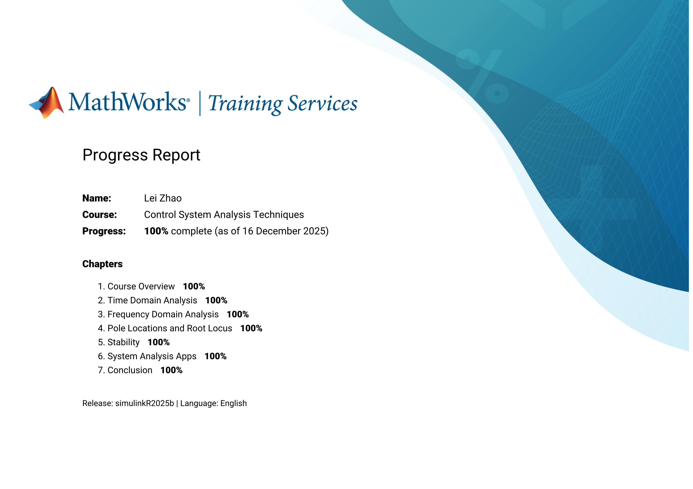
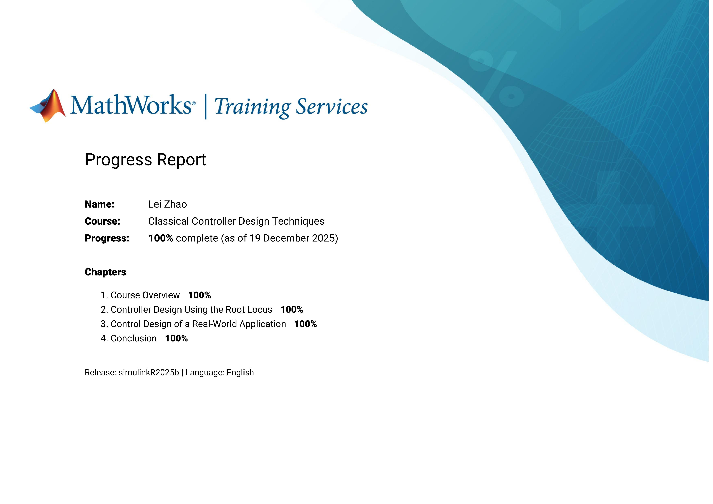
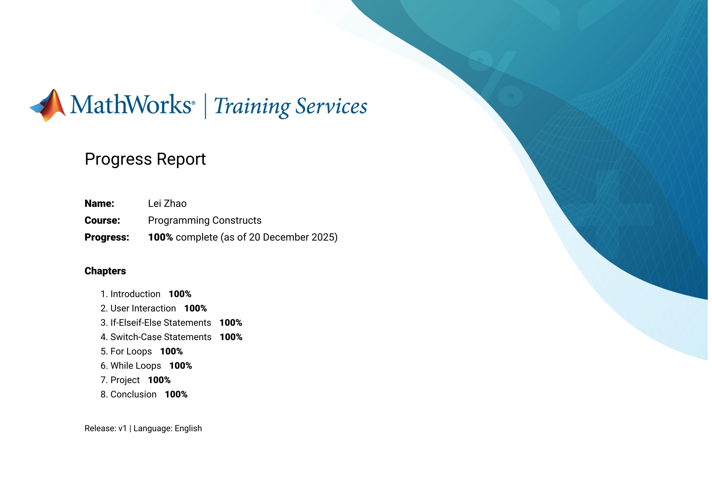
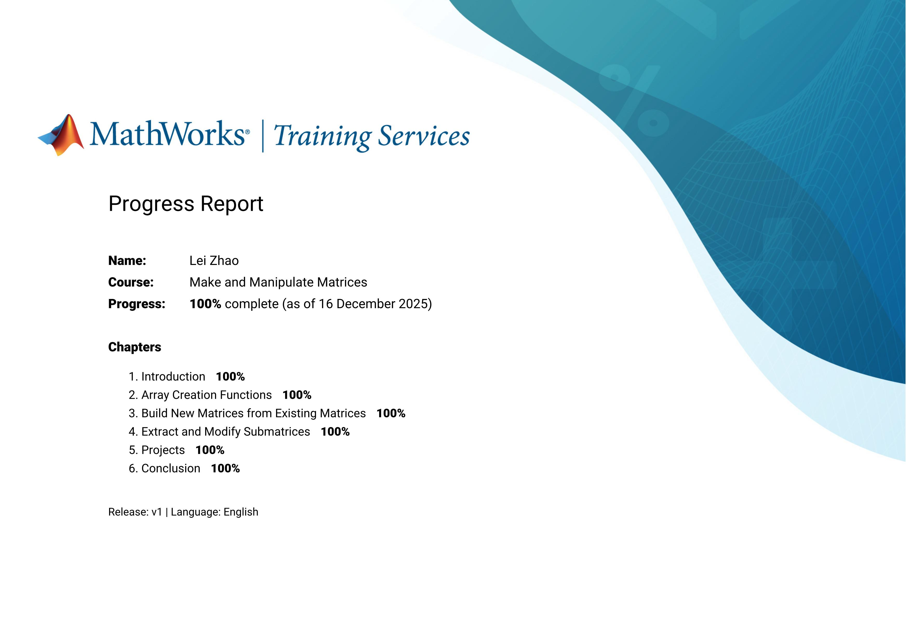
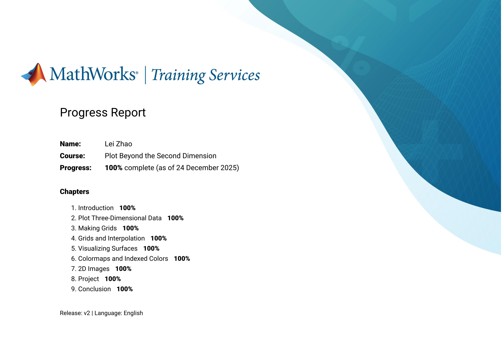
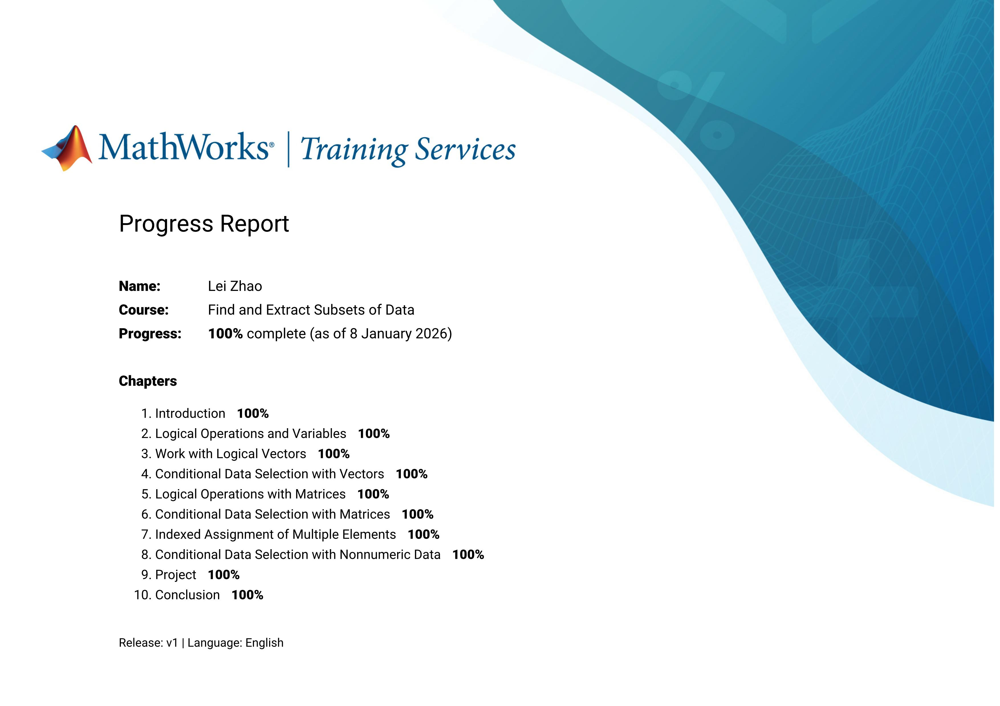
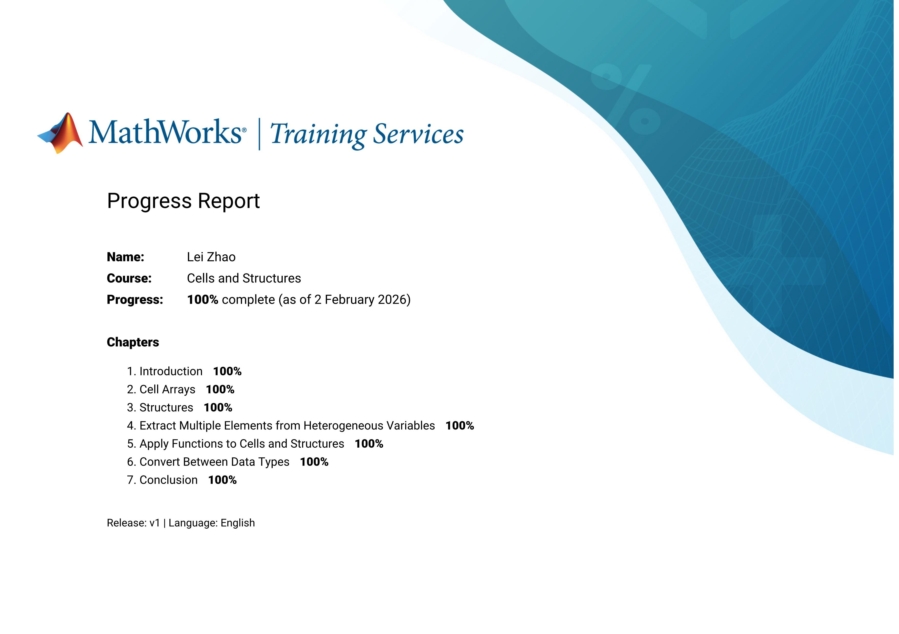
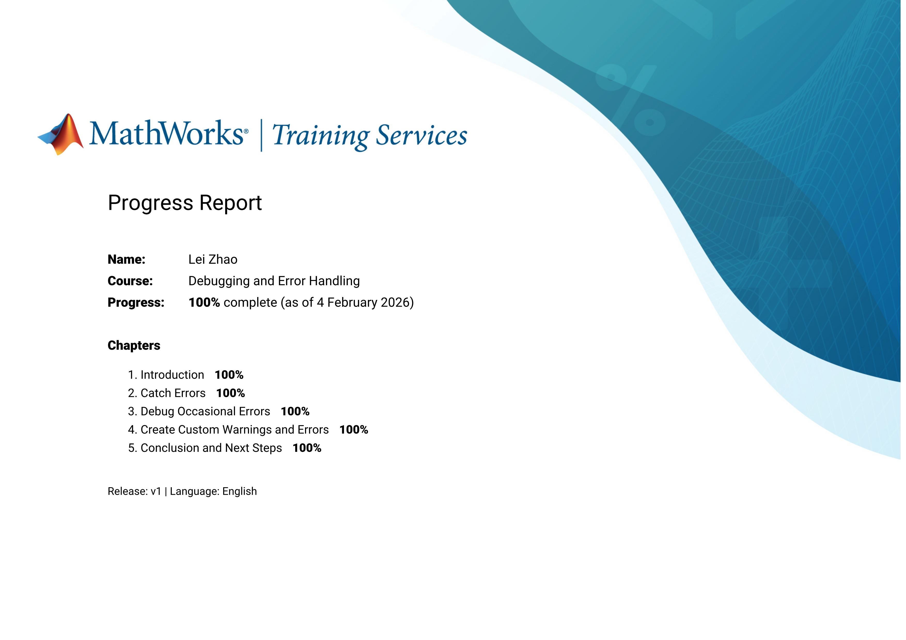

<h1 align="center">Certificate of Completion</h1>

   
<h1>MathWorks</h1>

   

        
<h2>Simulink</h2>

            

            
<h3>Learn Path</h3>

                

                    
<h4>Control System Design with MATLAB and Simulink</h4>

                    
                        
Control System Modeling Essentials

                        
                        
Linearization of Nonlinear Systems

                        
                        
Control System Analysis Techniques

                        
                        
PID Control Techniques

                        
                        
Classical Controller Design Techniques

                        
                

            

            

            
<h3>Simscape Battery Onramp</h3>

                 
            

            

            
<h3>Battery Pack Modeling</h3>

                 
            

            

            
<h3>Battery State Estimation</h3>

                 
            

            

            
<h3>Introduction to Motor Control</h3>

                 
            

            

            
<h3>Motor Modeling with Simscape Electrical</h3>

                 
            

            

            
<h3>Analyzing Results in Simulink</h3>

                 
            

            

            
<h3>Power Electronics Simulation Onramp</h3>

                 
            

            

            
<h3>Simulink Fundamentals</h3>

                 
            

            

            
<h3>Multibody Simulation Onramp</h3>

                 
            

            

            
<h3>System Composer Onramp</h3>

                 
            

            

            
<h3>Stateflow Onramp</h3>

                 
            

            

            
<h3>Circuit Simulation Onramp</h3>

                 
            

   

   

        
<h2>Matlab</h2>

        

            
<h3>Learn Path</h3>

                

                    
<h4>Core MATLAB Skills</h4>

                    
                        
MATLAB Desktop Tools and Troubleshooting Scripts

                        
                        
Explore Data with MATLAB Plots 

                        
                        
Make and Manipulate Matrices 

                        
                        
Calculations with Vectors and Matrices

                        
                 

                 

                    
<h4>Programming in MATLAB</h4>

                    
                        
MATLAB Desktop Tools and Troubleshooting Scripts

                        
                        
Programming Constructs

                        
                        
The How and Why of Writing Functions

                        
                 

                 

                    
<h4>MATLAB Skills for Simulink Modeling</h4>

                    
                        
MATLAB Desktop Tools and Troubleshooting Scripts

                        
                        
Programming Constructs

                        
                        
The How and Why of Writing Functions

                        
                        
Explore Data with MATLAB Plots

                        
                        
Make and Manipulate Matrices

                        
                 

                 

                    
<h4>Visualization in MATLAB</h4>

                    
                        
Explore Data with MATLAB Plots

                        
                        
Plot Beyond the Second Dimension

                        
                        
How MATLAB Graphics Work

                        
                 

                 

                    
<h4>Data Analysis in MATLAB</h4>

                    
                        
Tables

                        
                        
Clean and Prepare Data for Analysis

                        
                        
Common Data Analysis Techniques

                        
                         
Find and Extract Subsets of Data

                        
                        
Calculations on Grouped Data

                        
                 

                 

                    
<h4>Build MATLAB Proficiency</h4>

                    
                        
MATLAB Desktop Tools and Troubleshooting Scripts

                        
                        
Explore Data with MATLAB Plots

                        
                        
Make and Manipulate Matrices

                        
                        
Calculations with Vectors and Matrices

                        
                        
Tables

                        
                        
Find and Extract Subsets of Data

                        
                        
Programming Constructs

                        
                        
The How and Why of Writing Functions

                        
                 

                 

                    
<h4>Image Segmentation and Analysis in MATLAB</h4>

                    
                        
Color Spaces and Image Segmentation

                        
                        
Image Filtering and Enhancement

                        
                        
Semi-Automated Image Segmentation

                        
                        
Postprocessing to Improve Segmentation

                        
                        
Analyze Objects in Binary Images

                        
                 

                 

                    
<h4>Machine Learning Techniques in MATLAB</h4>

                    
                        
Classification Methods with Machine Learning

                        
                        
Regression Methods with Machine Learning

                        
                        
Cluster Analysis with Machine Learning

                        
                        
Dimensionality Reduction Techniques

                        
                 

                 

                    
<h4>Deep Learning Techniques in MATLAB for Image Applications</h4>

                    
                        
Explore Convolutional Neural Networks

                        
                        
Tune Deep Learning Training Options

                        
                        
Regression with Deep Learning

                        
                        
Object Detection with Deep Learning

                        
                 

                 

                    
<h4>Organize Tabular Data in MATLAB</h4>

                    
                        
Tables

                        
                        
Clean and Prepare Data for Analysis

                        
                        
Combine Tabular Datasets

                        
                        
Import Data from Multiple Files

                        
                 

                 

                    
<h4>Handle Inconsistent and Unstructured Data Files</h4>

                    
                        
Programming Constructs

                        
                        
A Tour of MATLAB Data Types

                        
                        
Import Irregular Data

                        
                        
Cells and Structures

                        
                        
Debugging and Error Handling

                        
                 

                 

                    
<h4>Software Development in MATLAB</h4>

                    
                        
Make Your Functions User-Friendly

                        
                        
Organize Your Functions

                        
                        
Unit Testing

                        
                 

                 

                    
<h4>Advanced MATLAB Programming Skills</h4>

                    
                        
A Tour of MATLAB Data Types

                        
                        
MATLAB Coding Practices for Efficiency and Performance

                        
                        
Debugging and Error Handling

                        
                        
Make Your Functions User-Friendly

                        
                 

                 

                    
<h4>Core Signal Processing Techniques in MATLAB</h4>

                    
                        
Signal Generation and Resampling

                        
                        
Spectral Analysis Techniques

                        
                        
Time-Frequency Analysis

                        
                        
Filter Design and Analysis Methods

                        
                 

        

    

   
<h1>MS Office</h1>

      

      
<h2>Excel</h2>

      
      

      

      
<h2>Word</h2>

      
      

      

      
<h2>PwoerPoint</h2>

      
      

